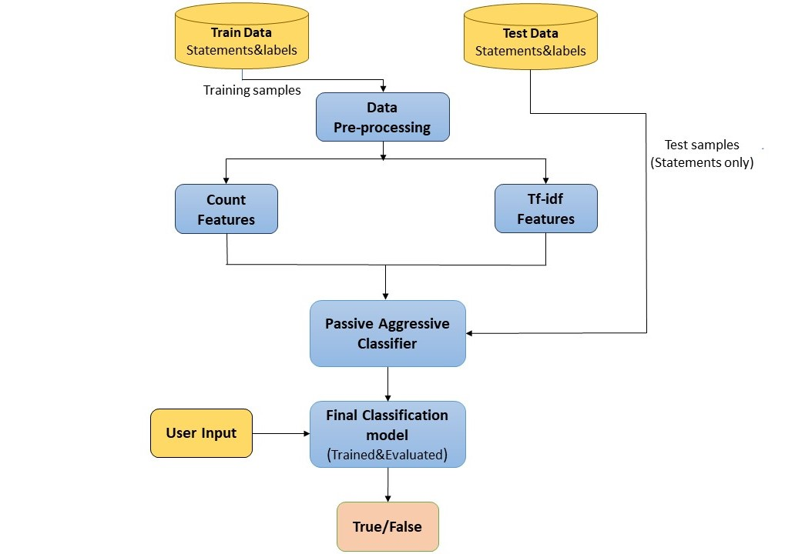

# Fake News Detection using Machine Learning
# http://54.88.59.187/
## Introduction
This repository presents a detailed project aimed at detecting fake news using machine learning and natural language processing (NLP) techniques. The project covers data preprocessing, model training, and the development of a web-based application for real-time fake news classification. The machine learning model is trained to determine whether a news article is genuine or fabricated based on its textual content.

## Problem Definition
The objective of this project is to create a machine learning system capable of identifying sources that frequently produce fake news. By analyzing multiple articles from a given source, the model can classify the source as reliable or unreliable. Once a source is flagged as a producer of fake news, future articles from that source can be predicted with high confidence to also be fake. This approach leverages multiple data points per source, reducing the likelihood of misclassifying individual articles.

The ultimate goal of this project is to assist in improving content visibility on social media platforms. By assigning visibility weights based on the model's predictions, social networks can suppress the spread of articles that are likely to be fake, thereby promoting more reliable information.

## Project Structure
The repository is organized into the following directories and files:
- **Images**: Contains important project images, such as block diagrams, classification reports, confusion matrices, and screenshots.
- **dataset**: Includes the dataset, consisting of train and test data from Kaggle, which is used to train and test the model.
- **static**: Houses static assets for the web application, including CSS, JavaScript, etc.
- **templates**: Includes HTML templates for the web application, such as `Landingpage.html` and `prediction page.html`.
- **Fake_News_Detector-PA.ipynb**: Jupyter Notebook file for data analysis and model training.
- **app.py**: Flask web application for real-time fake news detection.
- **model.pkl**: Pre-trained machine learning model for fake news detection.
- **vector.pkl**: Pre-trained vectorizer for text data.

## Datasets 
### train.csv
A full training dataset with the following attributes:
- `id`: unique id for a news article
- `title`: the title of a news article
- `author`: author of the news article
- `text`: the text of the article; could be incomplete
- `label`: a label that marks the article as potentially unreliable
  - `1`: unreliable
  - `0`: reliable

### test.csv
A testing training dataset with all the same attributes as `train.csv` without the label.

## Model Name
The machine learning model used for fake news detection in this project is the **Passive Aggressive Classifier**.

### Model Description
The Passive Aggressive Classifier (PAC) is a type of online learning algorithm for binary classification tasks. It is well-suited for applications like fake news detection. The PAC algorithm updates its model continuously as new data arrives, making it efficient for real-time classification.

### Model Accuracy
The Passive Aggressive Classifier achieved an impressive accuracy of **96%** during evaluation. This high accuracy indicates its effectiveness in classifying news articles as reliable or unreliable.

The model is pre-trained and available as `model.pkl` in this repository, allowing you to use it for making predictions.

Feel free to explore the Jupyter Notebook (`Fake_News_Detector-PA.ipynb`) for more details about the model's training and performance.

## Images
This section provides visuals and diagrams used in the project:
- Home Page:


- Prediction Page:


- Block Diagram:


- Process Flow Diagram:


- Confusion Matrix:


## Prerequisites
Before you begin, ensure you have met the following requirements:
- Python 3.7 or higher
- Install all dependencies from the requirements.txt file.

## Getting Started
To get started with this project, follow these steps:
1. Clone the repository to your local machine:
   ```bash
   git clone https://github.com/abiek12/Fake-News-Detection-using-MachineLearning.git
   ```

2. Create Conda environment: (optional but recommended):
   ```bash
   conda create --name my_env python=3.9 -y
   ```

3. Activate the Conda environment:
   ```bash
   conda activate my_env
   ```

4. Install project dependencies:
   ```bash
   pip install -r requirements.txt
   ```

5. Run the web application:
   ```bash
   python app.py
   ```

Access the application in your web browser by navigating to `http://localhost:5000`.

---


